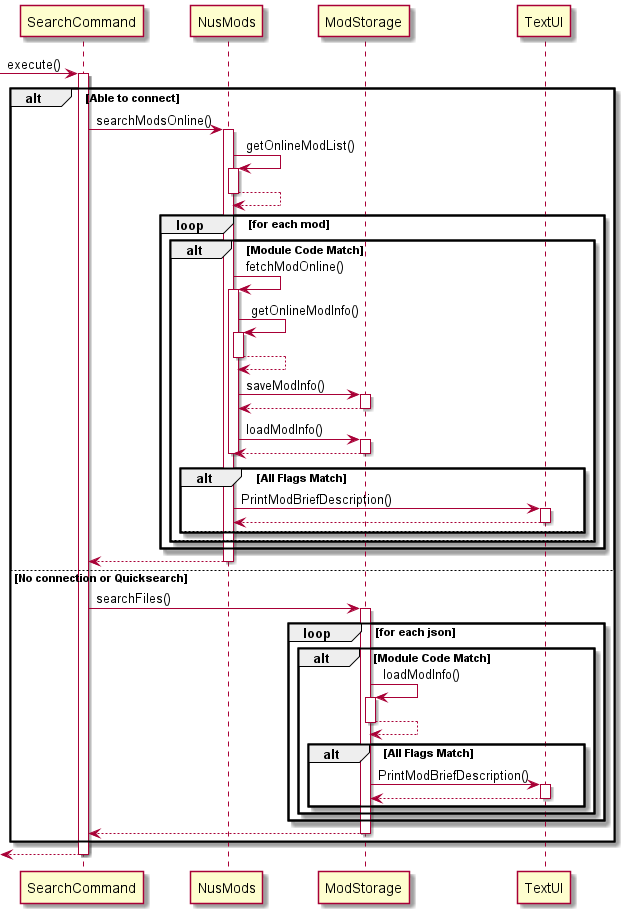

# Developer Guide
* [Acknowledgements](#acknowledgements)
* [Design & Implementation](#design-&-implementation)

* [Acknoledgements](#acknowledgements)

## Acknowledgements

{list here sources of all reused/adapted ideas, code, documentation, and third-party libraries -- include links to the original source as well}
* https://www.baeldung.com/java-testing-system-out-println

##Architecture

(Some architecture diagram)

## Design & implementation

{Describe the design and implementation of the product. Use UML diagrams and short code snippets where applicable.}

### Choose game mode

### Choose the game content

### Word Limit Game

Once the CommandFactory reads a 'word' command, a word limit game will begin.

Gonna to change this .puml diagram later - zhansen

### Time Limit Game

### Storage

## Product scope

Our product is a typing game, intent to provide enjoyment for people who are familiar with the CML.

### Target user profile

{Describe the target user profile}

### Value proposition

{Describe the value proposition: what problem does it solve?}

## User Stories

|Version| As a ... | I want to ... | So that I can ...|
|--------|----------|---------------|------------------|
|v1.0|new user|see usage instructions|refer to them when I forget how to use the application|
|v2.0|user|find a to-do item by name|locate a to-do without having to go through the entire list|

## Non-Functional Requirements

{Give non-functional requirements}
### Animation

## Glossary

* *glossary item* - Definition

## Instructions for manual testing

{Give instructions on how to do a manual product testing e.g., how to load sample data to be used for testing}
